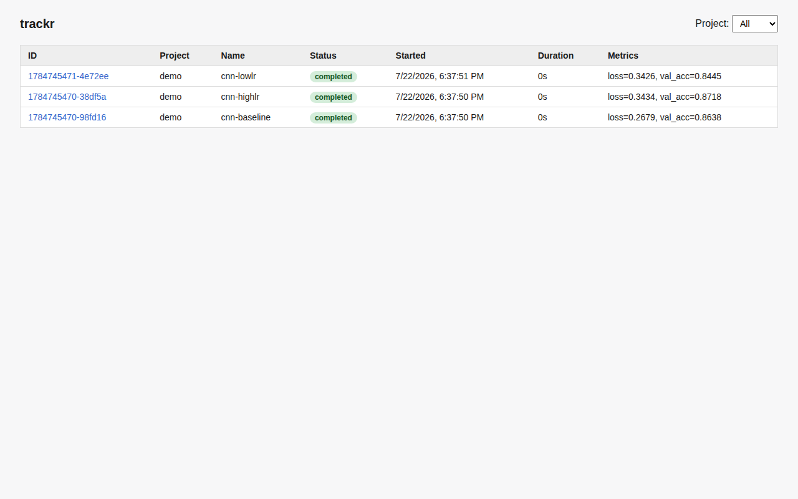
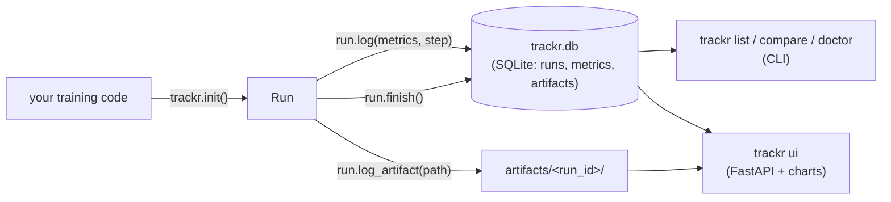
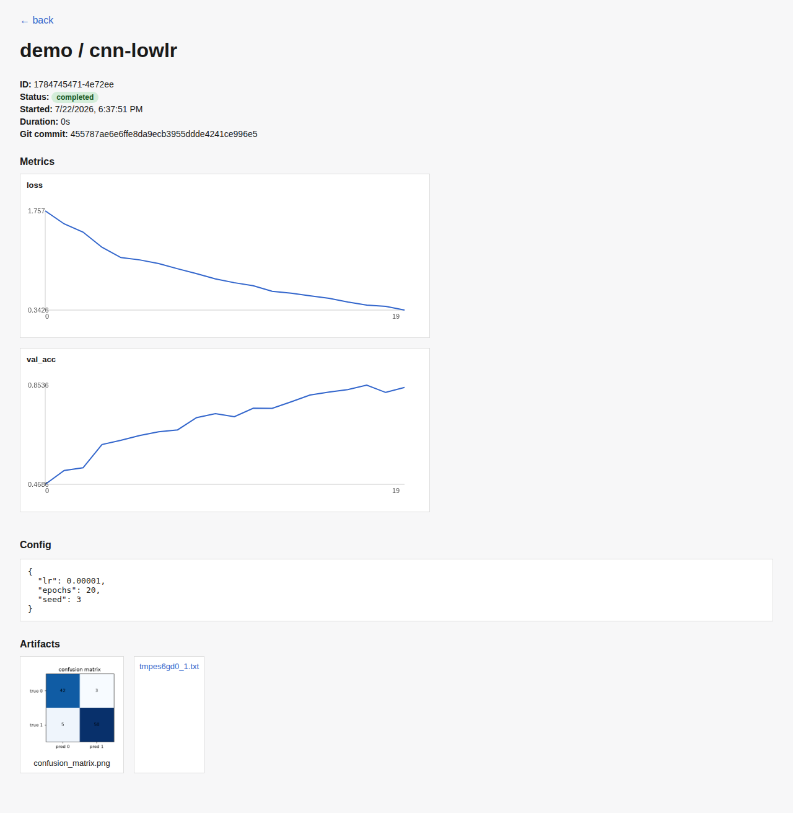

# trackr

A lightweight, local-first ML experiment tracker — a minimal alternative to
W&B/MLflow. Works fully offline, stores everything in a single SQLite file,
and ships with a small web UI for comparing runs. Framework-agnostic: not
tied to any particular project or ML library.



## How it fits together



Everything is written straight to `~/.trackr` as it happens — there's no
buffering server to lose data if your training script crashes, and no
network hop, since the CLI, the UI, and your training process all read and
write the same local file.

## Install

```
pip install -e .
```

## Quickstart

```python
import trackr

run = trackr.init(project="arvyo", name="cnn-baseline", config={"lr": 3e-4, "epochs": 20})
for step in range(100):
    run.log({"loss": 0.5, "val_acc": 0.81}, step=step)
run.log_artifact("confusion_matrix.png")   # copies file into run folder
run.finish(status="completed")
```

`run` also works as a context manager — `finish()` is called automatically,
with `status="failed"` if an exception propagates out of the `with` block.
If the process dies without calling `finish()`, the run stays `"running"`
in the DB; see `trackr doctor` below.

## CLI

```
trackr list [--project NAME]        # table of runs with final metric values
trackr compare RUN1 RUN2 ...        # side-by-side config diff + final metrics
trackr rm RUN1 [RUN2 ...] [-y]      # delete run(s) + their artifacts (prompts unless -y/--yes)
trackr ui [--host H] [--port P]     # launch the web UI (default 127.0.0.1:8000)
trackr doctor [--stale-minutes N]   # mark runs with no heartbeat in N min (default 10) as "crashed"
```

## Storage

Everything lives under `~/.trackr` (override with the `TRACKR_DIR` env var):

- `trackr.db` — SQLite database with `runs`, `metrics`, and `artifacts` tables
- `artifacts/<run_id>/` — files copied in via `run.log_artifact()`

## Web UI

`trackr ui` starts a local FastAPI server: a runs table (filterable by
project), and a per-run detail page with metric line charts, a config
viewer, and artifact previews (images render inline). No auth, no
multi-user support — it's meant to run on localhost against your own DB.

The run-detail page below is `demo / cnn-lowlr` from the fake-training demo:
metric charts for `loss` and `val_acc` over 20 logged steps, the run's
config dict, git commit (captured automatically at `trackr.init()` time if
the cwd is a git repo), and its two artifacts — a `confusion_matrix.png`
image artifact (rendered inline) and a plain-text run-summary artifact
(shown as a download link, since only images get an inline preview):



## Demo

```
python examples/fake_training.py   # simulates 3 runs with noisy loss curves
trackr list
trackr ui
```

`fake_training.py` seeds three runs (`cnn-baseline`, `cnn-highlr`,
`cnn-lowlr`) that share a project but vary `lr` in their config, each
logging a `loss`/`val_acc` pair per step so `trackr compare` and the UI's
line charts have something real to plot. The screenshots above were
generated from exactly this demo, with one run additionally logging a
`confusion_matrix.png` via `run.log_artifact()` to demonstrate the inline
image preview.

## Tests

```
pytest
```

## Non-goals for v1

Remote sync, teams, sweeps, and GPU monitoring are out of scope — see the
`TODO` stubs in `trackr/core.py`.
